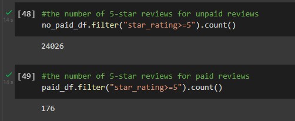
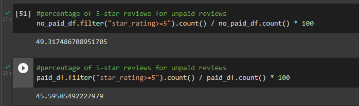

# Amazon_Vine_Analysis

## Overview of the analysis
The Amazon Vine program is a service that allows manufacturers and publishers to receive reviews for their products. Companies like SellBy pay a small fee to Amazon and provide products to Amazon Vine members, who are then required to publish a review.  
In this project, we’ll have access to approximately 50 datasets. Each one contains reviews of a specific product, from clothing apparel to wireless products. We picked one of these datasets and use PySpark to perform the ETL process to extract the dataset, transform the data, connect to an AWS RDS instance, and load the transformed data into pgAdmin. Next, we’ll use PySpark to determine if there is any bias toward favorable reviews from Vine members in our dataset. 

## Results

First we decided to filter the reviews with more than 20 total votes which are more likely to be helpful.

- How many Vine reviews and non-Vine reviews were there?
From a total of 49,103 only 386 were part of the vine program which represents 0.78% versus 99.21% from non-vine program

- How many Vine reviews were 5 stars? How many non-Vine reviews were 5 stars?

- What percentage of Vine reviews were 5 stars? What percentage of non-Vine reviews were 5 stars?

## Summary

Based on the results we can say that the vine progran has not a significant impact in lawn and garden products considering that less than 1 percents of the given reviews came from this program. Aditional we could say that the unpaid reviews have a better 5 star percentage; 49% from unpaid versus 45% from the vine program. 

